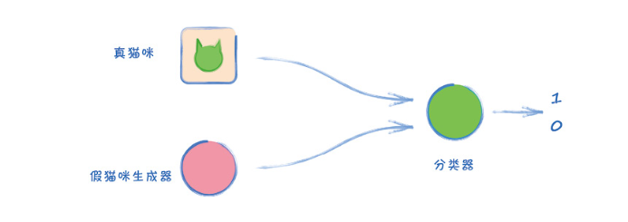
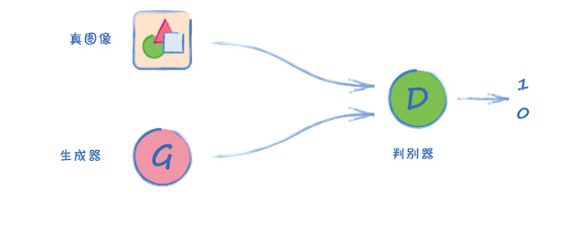
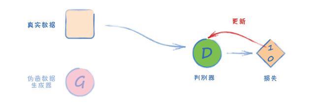
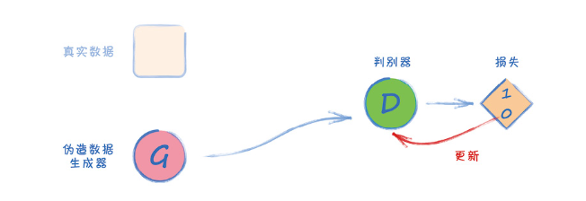
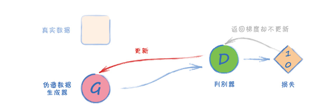

# GAN初步

## 2.1 GAN

### 2.1.1 生成图像

生成图像的目标是反向查询：


网络生成图像的目标：

1. 生成不同的图像
2. 生成的图像应该像一个样本而不是数据集的平滑平均值

### 2.1.2 对抗训练



目标是生成一个**生成器**(generator)，然后把分类器称为**鉴别器**(discriminator)。



如何训练生成器：

1. 如果图像通过了鉴别器，我们奖励生成器
2. 如果伪造的图像被识破，我们惩罚生成器

如此这般，生成器需要几部来适应鉴别器的进步，所以鉴别器和生成器是竞争对手（adversary）关系，因此，叫做GAN（Generative Adversarial Network）。

### 2.1.3 GAN的训练

GAN的训练逻辑：

1. 向鉴别器展示真实数据，告诉他样本分类1（训练鉴别器）
2. 向鉴别器展示一个生成器输出，告诉它该样本分类是0（训练鉴别器）
3. 向鉴别器展示一个生成器的输出，告诉生成器的结果是1（训练生成器）







### 2.1.4 训练GAN的挑战

1. 鉴别器进步太快，生成器无法追上
2. 鉴别器学习太慢，生成器会因为不断生成质量差的图像而受到奖励

## 2.2 生成1010格式规律


```python
class Discriminator(nn.Module):
    """判别器
    """

    def __init__(self):
        super().__init__()

        self.model = nn.Sequential(
            nn.Linear(4, 3),
            nn.Sigmoid(),
            nn.Linear(3, 1),
            nn.Sigmoid()
        )

        self.loss_function = nn.MSELoss()

        self.optimiser = torch.optim.SGD(
            self.parameters(),
            lr=0.01
        )

        self.counter = 0
        self.progress = []

    def forward(self, inputs):
        return self.model(inputs)
    
    def train(self, inputs, targets) -> NoReturn:
        outputs = self.forward(inputs)

        loss = self.loss_function(outputs, targets)

        self.counter += 1

        if self.counter % 10 == 0:
            self.progress.append(loss.item())

        if self.counter % 10000 == 0:
            print(f"counter = {self.counter}")

        self.optimiser.zero_grad()
        loss.backward()
        self.optimiser.step()

    def plot_progress(self) -> NoReturn:
        """绘制过程图
        """
        df = pd.DataFrame({
            "step": [i * 10 for i in range(1, len(self.progress) + 1)],
            "loss": self.progress
        })

        fig = px.line(df, x="step", y="loss")
        fig.show()
```

### 2.2.4 构建生成器

与判别式最大的区别是**没有`self.loss_function`**。损失函数式通过鉴别器计算出来的。

## 2.3 生成手写数字


### 2.3.4 MNIST生成器


现在需要一个随机种子生成器，来生成不同图像：


### 2.3.7 模式奔溃

模式崩溃（mode collapse）是指，只能生成一种类型的数据：


可能的解释是：在鉴别器学会向生成器提供良好的反馈之前，生成器已经发行了一个一直被判定为真实图像的输出。

一些改进方法：

1. `SGD`改为`Adam`
2. 修改网络结构
3. 随机数生成方法改为`randn`
4. 使用交叉商`BCELoss`而不是`MSELoss`

### 2.3.9 种子实验


种子之间的数值可能使图像也介于期间；种子相加，则产生了类似两个的。