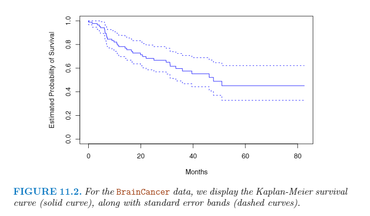

# 第十一章 生存分析和截尾数据

## 11.1 生存和截尾时间

一般我们能观察到两个时间，一个是截尾时间$C$和一个生存时间$T$。即我们可以看到下面的随机变量：

$$
Y = min(T, C)
$$

此外我们可以设定一个$\delta$来记录是否在真的截尾了。

$$
\delta = \begin{cases}
1 && \text{if } T \le C \\
0 && \text{if } T > C
\end{cases}
$$

这样可以得到下面的图片：

## 11.3 Kaplan-Meier生存曲线

生存曲线，生存函数定义为

$$
S(t) = Pr(T > t)
$$

## 11.4 Log-Rank测试

Log-Rank测试是用来验证两条KM曲线是否相同。

||Group 1| Group 2| Total |
|:---:|:---:|:---:|:--:|
|Died|$q_{1k}$|$q_{2k}$|$q_k$|
|Survived|$r_{1k} - q_{1k}$|$r_{2k} - q_{2k}$|$r_k - q_k$|
|Total|r_{1k}|r_{2k}|r_{k}|

设定$W$为

$$
W = \frac {X - E(X)} {\sqrt{Var(X)}}
$$

$$
E(q_{1k}) = \frac {r_{1k}} {r_k} q_k
$$

$$
Var(q_{1k}) = \frac 
    {q_k(r_{1k}/r_k)(1 - r_{1k}/r_k)(r_k - q_k)}
    {r_k - 1}
$$

$$
Var(\sum^K_{k = 1} q_{1k}) \approx \sum^K_{k=1} Var(q_{1k})
    = \sum_{k=1}^K \frac
        {q_k(r_{1k}/r_{k})(1 - r_{1k}/ r_k)(r_k - q_k)}
        {r_k - 1}
$$

从而

$$
W = \frac 
    {\sum_{k=1}^K(q_{1k} - E(q_{1k}))}
    {\sqrt{\sum^K_{k=1}Var(q_{1k})}}
  = \frac
    {\sum{k=1}^K(q_{1k} - \frac{q_k}{r_k}r_{1k})}
    {\sqrt{\sum^K_{k=1}
        \frac
            {q_k(r_{1k}/r_k)(1 - r_{1k}/r_{k})(r_k - q_k)}
            {r_k - 1}}}
$$

## 11.5 回归模型

### 11.5.1 Hazard函数

$$
h(t) = \lim_{\Delta t \to 0} \frac
    {Pr(t < T \le t + \Delta t | T > t)}
    {\Delta t}
    \approx \frac
    {Pr(t < T  \le t + \Delta t | T > t)}
    {\Delta t}
    = \frac {f(t)} {S(t)}
$$

其第$i$的likelihood为

$$
\begin{align}
L_i && = 
\begin{cases}
f(y_i) && \text{if the }i\text{th obsevation is not censored}\\
S(y_i) && \text{if the }i\text{th obsevation is censored}
\end{cases}
\\
= && f(y_i)^{\delta_i}S(y_i)^{1 - \delta_i}
\end{align}
$$

### 11.5.2 比例Hazards

$$
h(t|x_i) = h_0(t) exp(\sum^p_{j=1} x_{ij}\beta_j)
$$
