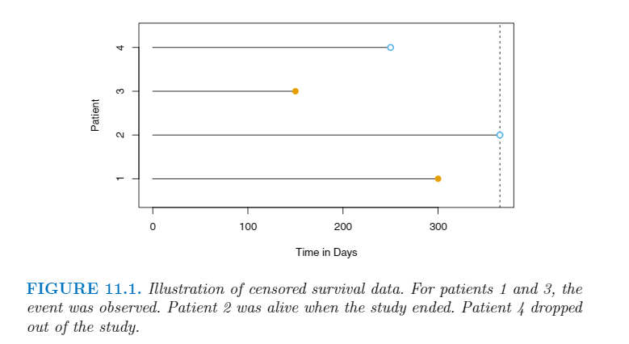

# 第十一章 生存分析和截尾数据

## 11.1 生存和截尾时间

一般我们能观察到两个时间，一个是截尾时间$C$和一个生存时间$T$。即我们可以看到下面的随机变量：

$$
Y = min(T, C)
$$

此外我们可以设定一个$\delta$来记录是否在真的截尾了。

$$
\delta = \begin{cases}
1 && \text{if } T \le C \\
0 && \text{if } T > C
\end{cases}
$$

这样可以得到下面的图片：

