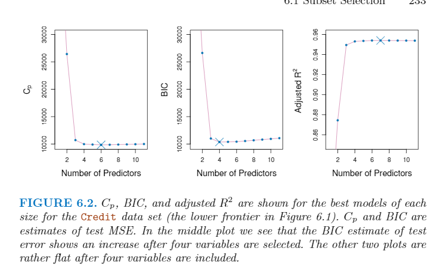
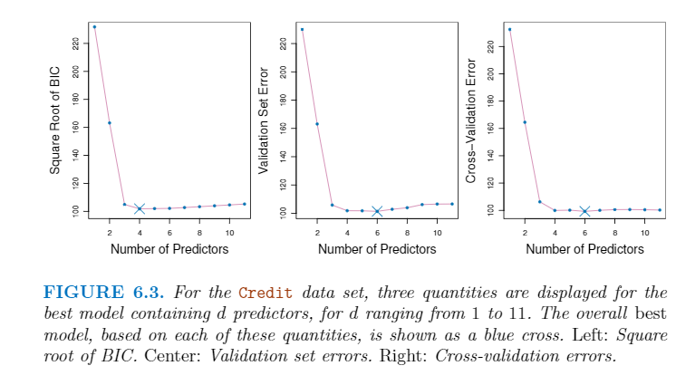
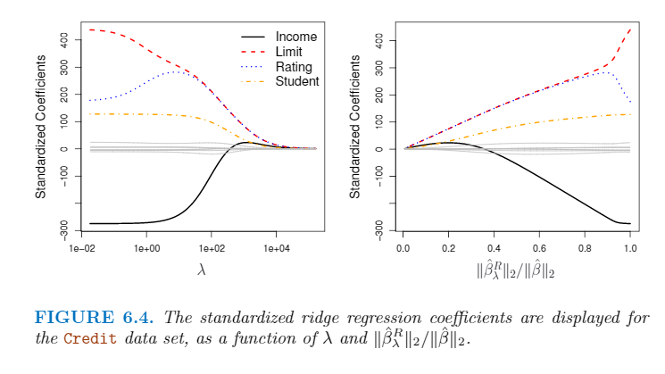
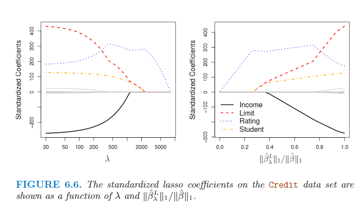
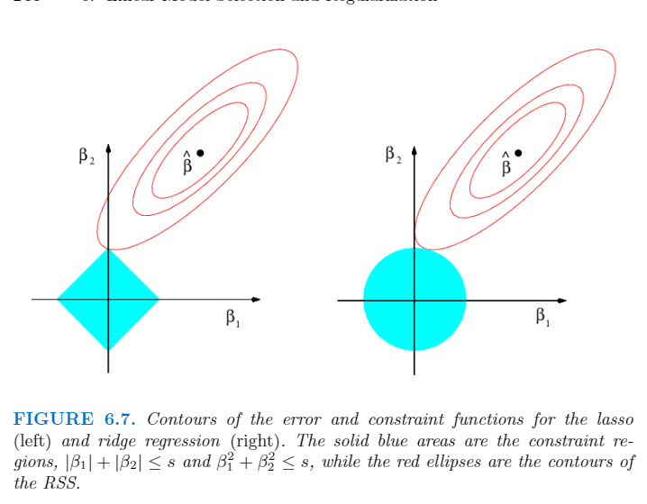

# 第六章 线性模型选择和正则化

拟合过程的修改基于两个原因：**预测精确度**和**模型可解释性**

## 6.1 子集选择(Subset Selection)

### 6.1.1 最优子集选择

### 6.1.2 分步选择(Stepwise Selection)

#### 前向分步选择

#### 后向分步选择

### 6.1.3 选择最佳模型

#### 如何选择

1. 非直接地使用训练错误
2. 直接使用CV方法。

#### $C_p$、AIC, BIC和调整的$R^2$

$$
C_p = \frac 1 n (RSS+ 2d\hat{\sigma ^ 2})
$$

$$
AIC = \frac 1 n (RSS + 2d\hat{\sigma ^ 2})
$$

$$
BIC = \frac 1 n (RSS + log(n)d\hat{\sigma ^ 2})
$$

$$
\text{Adusted } {R}^2 = 1 - frac {RSS/(n - d - 1)} {TSS / (n - 1)}
$$

#### Validation和CV

## 6.2 收缩方法

### 6.2.1 岭回归

$$
RSS = \sum^n_{i = 1} (y_i - \beta_0 - \sum^p_{j=1} \beta_j x_{ij}) ^ 2
$$

岭回归的优化函数

$$
RSS + \lambda \sum^p_{j=1} \beta ^ 2 _ j
$$

### 6.2.2 The Lasso

$$
RSS + \lambda \sum^p_{j=1} |\beta_j|
$$

## 6.3 降维方法

### 6.3.1 PCA

### 6.3.2 偏最小二乘(Partial Least Squares, PLS)

## 6.4 高维度数据

### 6.4.2 高位数据的问题

### 6.4.3 高维中的回归

